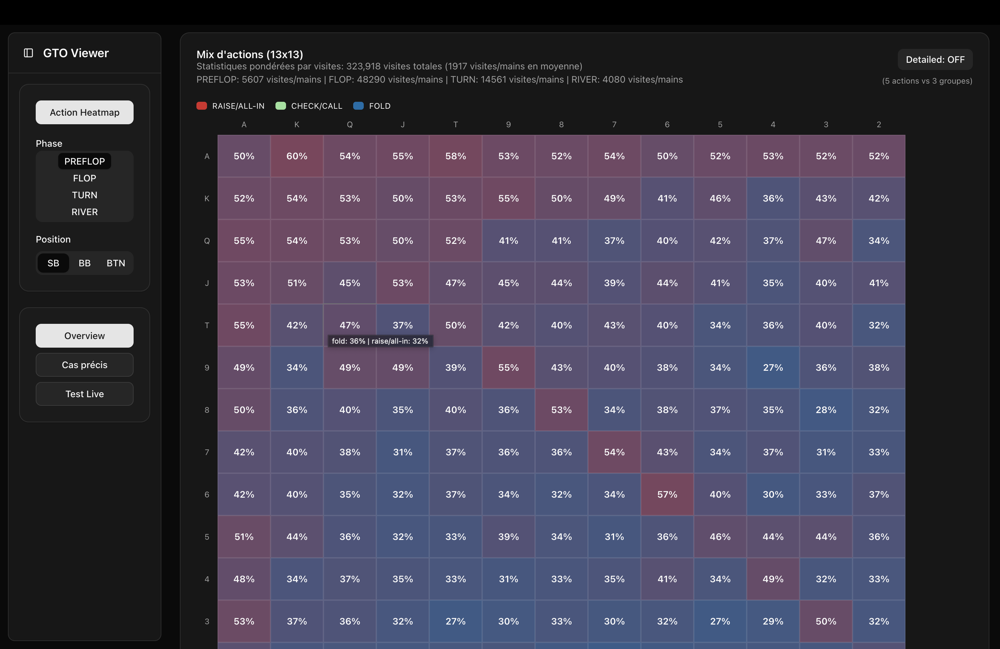
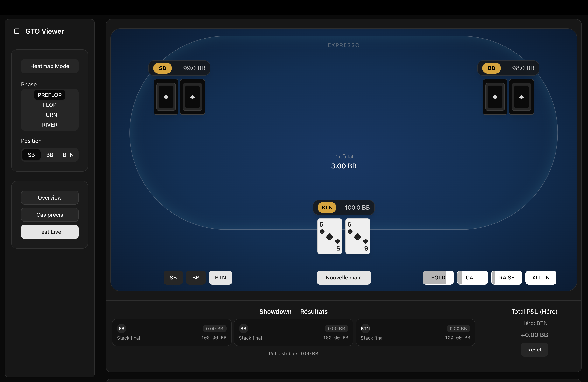

# GTO_Bot

Experimental project around a CFR+ solver (3-handed NLHE), an ML model approximating the policy, and a Next.js UI to explore the results.

## Overview
- External-sampling CFR+ (3-handed, minimal-raise) in `cfr_solver.py` relies on `poker_game_expresso.PokerGameExpresso` and compact infoset keys in `infoset.py`.
- The average policy is serialized as compact gzipped JSON (bitmask + quantized values) in `policy/avg_policy.json.gz` and duplicated for the UI in `ui/public/avg_policy.json.gz`.
- A PyTorch model (`ml/model.py`) is trained to approximate this policy with `ml/train.py`. Visualizations (e.g., preflop heatmap) are in `ml/viz.py`.
- The UI (`ui/`) is a Next.js/TypeScript app that loads the policy from `public/avg_policy.json.gz`.

## Screenshots

### Preflop Heatmap
The preflop range visualization (aggregate raise/all-in vs fold ratio across 13x13 hand grid).



### Live Test Board
Interactive live testing table in the web UI where you can play against the GTO policy.



## Python setup (core + ML)
```bash
# Create a venv and install dependencies (example)
python -m venv .venv
source .venv/bin/activate
pip install torch numpy pandas treys tqdm seaborn matplotlib
```

## Run CFR+ training
`cfr_solver.py` trains the solver, saves the policy, and exports a copy for the UI.

```bash
python cfr_solver.py
```
Main outputs:
- `policy/avg_policy.json.gz`
- `ui/public/avg_policy.json.gz`
- `policy/avg_policy.csv` (via `stats_policy.extraction_policy_data()`)

Key parameters (edit in `cfr_solver.py`):
- `iterations` (default 1_000_000)
- `stacks` (e.g., `(100, 100, 100)`)
- `SAVE_EVERY` for checkpoints (0 = disabled)

## Analyze and export to CSV
```bash
python stats_policy.py  # reads policy/avg_policy.json.gz and writes policy/avg_policy.csv
```

`stats_policy.py` reconstructs action distributions, decodes infoset keys, and produces a CSV for quick exploration.

## Train the ML model on the policy
```bash
cd ml
python train.py  # reads ../policy/avg_policy.json.gz, trains, and saves trained_policy_model.pth
```
Notes:
- Input: 224-dim one-hot features (phase, role, hand 169, board 31, 3 normalized scalars, hero-vs-board 11)
- Output: 5 canonical actions `FOLD, CHECK, CALL, RAISE, ALL-IN`
- Loss: MSE over distributions (model outputs softmax)

## Visualizations (preflop heatmap)
From `ml/`:
```bash
python viz.py  # produces ml/preflop_heatmap.png using trained_policy_model.pth
```
You can adjust `role_id` and bucketing parameters in `ml/viz.py`.

## Next.js UI
The UI lives in `ui/`. It reads `public/avg_policy.json.gz`.

```bash
cd ui
npm install
npm run dev  # start UI in development mode
```

Key sources in `ui/src/`:
- `lib/policy.ts`, `lib/infoset.ts`, `lib/game.ts`: parsing/logic
- `components/` and `app/` for pages and widgets

## Policy format (compact)
Each entry in `avg_policy.json.gz` is:
```json
{
  "<infoset_key_u64>": {
    "policy": [bitmask, q1, q2, ...],
    "visits": <int capped>
  }
}
```
- `bitmask`: which actions (by index) are present
- `q_i`: quantized integers (0..255), sum adjusted to 255
- Rebuild: `prob[action] = q_i / sum(q)` in the order of set bits

Infoset fields are packed into a `u64` (see `infoset.py`):
- `PHASE` (3 bits), `ROLE` (2), `HAND` (8, 13x13 index), `BOARD` (5), `POT` (8), `RATIO` (8), `SPR` (8), `HEROBOARD` (4)

## Directory structure (excerpt)
```
GTO_Bot/
  cfr_solver.py                # CFR+ training, policy export
  poker_game_expresso.py       # 3-handed env + betting/pot logic
  infoset.py                   # Bucketing, u64 pack/unpack, 169 mapping
  policy.py                    # Load/sample compact average policy
  stats_policy.py              # Decode policy -> CSV and stats
  utils.py                     # Hand evaluation (Treys) and range I/O
  ml/
    model.py                   # PyTorch network
    train.py                   # Training pipeline on policy
    viz.py                     # Heatmaps and visualizations
  policy/
    avg_policy.json.gz         # Average policy (solver output)
    avg_policy.csv             # Tabular export
  ui/                          # Next.js/TypeScript app
    public/avg_policy.json.gz  # Policy copy for the UI
```